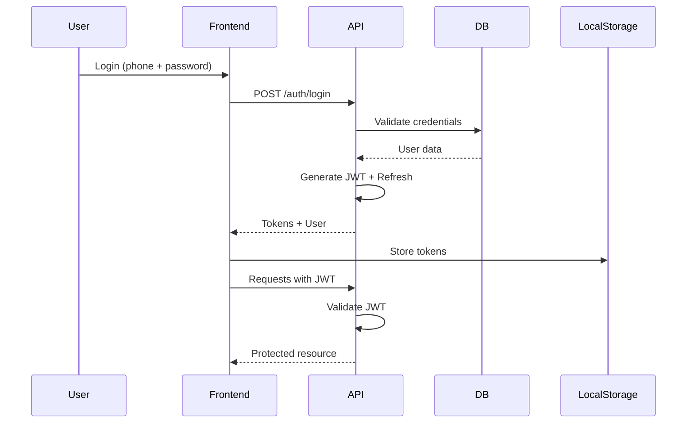

# ShiftBalance - Technical Architecture

## 🏗️ System Architecture Overview

```
┌─────────────────────────────────────────────────────────────┐
│                         Frontend (PWA)                       │
│                    React + TypeScript + PWA                  │
│                         Zustand Store                        │
└───────────────┬─────────────────────────┬───────────────────┘
                │                         │
                │     HTTPS / JWT         │
                ▼                         ▼
┌───────────────────────────────────────────────────────────┐
│                      API Gateway                            │
│                   Express + Rate Limiting                   │
│                      CORS + Security                        │
└───────────────┬─────────────────────────┬─────────────────┘
                │                         │
    ┌───────────▼──────────┐   ┌─────────▼──────────┐
    │   Business Logic     │   │   Authentication   │
    │   Services Layer     │   │    JWT + Refresh   │
    │                      │   │                    │
    └──────────┬───────────┘   └────────┬──────────┘
               │                         │
    ┌──────────▼─────────────────────────▼──────────┐
    │              Database Layer                    │
    │          PostgreSQL + Prisma ORM              │
    │                                               │
    └───────────────────────────────────────────────┘
               │                         │
    ┌──────────▼──────────┐   ┌─────────▼──────────┐
    │   Queue Service     │   │  Notification      │
    │   (Bull Queue)      │   │   Service          │
    │                     │   │  (Push + SMS)      │
    └─────────────────────┘   └────────────────────┘
```

---

## 📦 Technology Stack

### **Frontend**
```javascript
{
  "core": {
    "framework": "React 18",
    "language": "TypeScript",
    "styling": "TailwindCSS",
    "animations": "Framer Motion",
    "state": "Zustand",
    "routing": "React Router v6",
    "forms": "React Hook Form",
    "validation": "Zod"
  },
  "pwa": {
    "serviceWorker": "Workbox",
    "notifications": "Web Push API",
    "offline": "IndexedDB + Cache API"
  },
  "utilities": {
    "dates": "date-fns",
    "http": "Axios + React Query",
    "charts": "Recharts",
    "tables": "TanStack Table"
  }
}
```

### **Backend**
```javascript
{
  "runtime": "Node.js 20 LTS",
  "framework": "Express.js",
  "language": "TypeScript",
  "database": {
    "primary": "PostgreSQL 15",
    "orm": "Prisma",
    "cache": "Redis",
    "migrations": "Prisma Migrate"
  },
  "authentication": {
    "strategy": "JWT + Refresh Token",
    "encryption": "bcrypt",
    "sessions": "express-session + Redis"
  },
  "queues": "Bull + Redis",
  "realtime": "Socket.io",
  "validation": "Joi/Zod",
  "logging": "Winston + Morgan"
}
```

### **Infrastructure**
```yaml
production:
  frontend:
    host: Vercel
    cdn: Cloudflare
    domain: app.shiftbalance.co.il
  
  backend:
    host: Railway / Render
    region: eu-west-1
    scaling: Horizontal (2-5 instances)
  
  database:
    host: Railway PostgreSQL
    backup: Daily automated
    replication: Read replica
  
  storage:
    images: Cloudinary
    documents: AWS S3
  
  monitoring:
    errors: Sentry
    analytics: Google Analytics
    uptime: UptimeRobot
    logs: LogRocket
```

---

## 🔐 Security Architecture

### **Authentication Flow**


### **Security Layers**
```typescript
interface SecurityConfig {
  // Rate Limiting
  rateLimit: {
    windowMs: 15 * 60 * 1000,  // 15 minutes
    max: 100,                   // requests per window
    loginMax: 5                 // login attempts
  },
  
  // Headers
  helmet: {
    contentSecurityPolicy: true,
    crossOriginEmbedderPolicy: true,
    dnsPrefetchControl: true
  },
  
  // CORS
  cors: {
    origin: ['https://app.shiftbalance.co.il'],
    credentials: true
  },
  
  // Data Validation
  validation: {
    inputSanitization: true,
    sqlInjectionProtection: true,
    xssProtection: true
  },
  
  // Encryption
  encryption: {
    passwords: 'bcrypt (rounds: 12)',
    data: 'AES-256-GCM',
    transport: 'TLS 1.3'
  }
}
```

---

## 🎯 Core Algorithms

### **Shift Balancing Algorithm**
```typescript
class ShiftBalancer {
  private readonly weights = {
    expert: 40,
    intermediate: 25,
    runner: 15,
    trainee: 10
  };

  private readonly rules = {
    minQualityScore: 60,
    maxTraineePercentage: 30,
    requiredExpertCount: 1,
    alternativeIntermediateCount: 2
  };

  public balanceShift(
    availableEmployees: Employee[],
    shiftRequirements: ShiftRequirement
  ): ShiftAssignment {
    // Step 1: Filter available employees
    const candidates = this.filterByAvailability(
      availableEmployees,
      shiftRequirements
    );

    // Step 2: Calculate optimal composition
    const composition = this.calculateOptimalComposition(
      candidates,
      shiftRequirements.requiredCount
    );

    // Step 3: Apply fairness rules
    const fairAdjusted = this.applyFairShareRules(
      composition,
      this.getHistoricalData()
    );

    // Step 4: Validate and score
    const finalAssignment = this.validateAndScore(fairAdjusted);

    return finalAssignment;
  }

  private calculateQualityScore(employees: Employee[]): number {
    const totalPoints = employees.reduce((sum, emp) => {
      return sum + this.weights[emp.level];
    }, 0);

    const maxPossible = employees.length * this.weights.expert;
    return Math.round((totalPoints / maxPossible) * 100);
  }
}
```

### **Fair Share Algorithm**
```typescript
class FairShareManager {
  public distributeShifts(
    employees: Employee[],
    weeklySchedule: Schedule
  ): Map<string, Assignment[]> {
    const assignments = new Map();
    
    // Track metrics per employee
    const metrics = {
      shiftCounts: new Map<string, number>(),
      morningEveningRatio: new Map<string, Ratio>(),
      lastShiftDate: new Map<string, Date>()
    };

    // Distribute evenly
    for (const shift of weeklySchedule.shifts) {
      const eligibleEmployees = this.getEligible(employees, shift);
      
      // Sort by fairness score (less shifts = higher priority)
      eligibleEmployees.sort((a, b) => {
        const scoreA = this.calculateFairnessScore(a, metrics);
        const scoreB = this.calculateFairnessScore(b, metrics);
        return scoreB - scoreA;
      });

      // Assign based on fairness
      const assigned = this.assignWithFairness(
        eligibleEmployees,
        shift,
        metrics
      );
      
      assignments.set(shift.id, assigned);
    }

    return assignments;
  }
}
```

---

## 📊 Database Design Patterns

### **Soft Deletes**
```sql
-- All entities have soft delete capability
ALTER TABLE users ADD COLUMN deleted_at TIMESTAMP;
ALTER TABLE shifts ADD COLUMN deleted_at TIMESTAMP;

-- Query only active records
CREATE VIEW active_users AS
SELECT * FROM users WHERE deleted_at IS NULL;
```

### **Audit Trail**
```sql
CREATE TABLE audit_logs (
  id UUID PRIMARY KEY,
  entity_type VARCHAR(50),
  entity_id UUID,
  action VARCHAR(20),
  old_values JSONB,
  new_values JSONB,
  user_id UUID,
  created_at TIMESTAMP DEFAULT NOW()
);
```

### **Database Indexes**
```sql
-- Performance critical indexes
CREATE INDEX idx_shifts_date_type ON shifts(date, type);
CREATE INDEX idx_availability_user_schedule ON availability(user_id, schedule_id);
CREATE INDEX idx_swaps_status ON swap_requests(status) WHERE status = 'PENDING';
CREATE INDEX idx_notifications_user_unread ON notifications(user_id, is_read) WHERE is_read = false;
```

---

## 🔄 API Design Patterns

### **RESTful Conventions**
```typescript
// Resource naming
GET    /api/v1/resources       // List
GET    /api/v1/resources/:id   // Get one
POST   /api/v1/resources       // Create
PUT    /api/v1/resources/:id   // Update (full)
PATCH  /api/v1/resources/:id   // Update (partial)
DELETE /api/v1/resources/:id   // Delete

// Filtering & Pagination
GET /api/v1/shifts?date=2024-01-01&type=lunch&page=1&limit=20

// Nested resources
GET /api/v1/users/:id/shifts
GET /api/v1/schedules/:id/availability
```

### **Response Format**
```typescript
interface ApiResponse<T> {
  success: boolean;
  data?: T;
  error?: {
    code: string;
    message: string;
    details?: any;
  };
  meta?: {
    page?: number;
    limit?: number;
    total?: number;
    timestamp: string;
  };
}
```

---

## 🚀 Performance Optimization

### **Caching Strategy**
```typescript
const cacheStrategy = {
  // Redis cache layers
  L1_Cache: {
    type: "Memory",
    ttl: 60,  // seconds
    items: ["user_session", "permissions"]
  },
  L2_Cache: {
    type: "Redis",
    ttl: 3600,  // 1 hour
    items: ["schedule", "employee_list", "shift_templates"]
  },
  L3_Cache: {
    type: "CDN",
    ttl: 86400,  // 24 hours
    items: ["static_assets", "images"]
  }
};
```

### **Query Optimization**
```typescript
// Use Prisma's include wisely
const getShiftWithDetails = await prisma.shift.findUnique({
  where: { id },
  include: {
    employees: {
      select: {
        id: true,
        fullName: true,
        level: true,
        position: true
      }
    },
    shiftManager: {
      select: {
        id: true,
        fullName: true
      }
    }
  }
});

// Batch operations
const batchUpdate = await prisma.$transaction([
  prisma.shift.updateMany({ ... }),
  prisma.notification.createMany({ ... })
]);
```

---

## 📱 PWA Architecture

### **Service Worker Strategy**
```javascript
// Caching strategies
const strategies = {
  // Network first for API calls
  api: new NetworkFirst({
    cacheName: 'api-cache',
    networkTimeoutSeconds: 5,
    plugins: [
      new ExpirationPlugin({
        maxEntries: 50,
        maxAgeSeconds: 5 * 60 // 5 minutes
      })
    ]
  }),
  
  // Cache first for assets
  assets: new CacheFirst({
    cacheName: 'asset-cache',
    plugins: [
      new ExpirationPlugin({
        maxEntries: 100,
        maxAgeSeconds: 30 * 24 * 60 * 60 // 30 days
      })
    ]
  }),
  
  // Stale while revalidate for dynamic content
  content: new StaleWhileRevalidate({
    cacheName: 'content-cache'
  })
};
```

### **Push Notification Architecture**
```typescript
class NotificationService {
  async sendPushNotification(
    userId: string,
    notification: Notification
  ) {
    // Get user's push subscription
    const subscription = await this.getPushSubscription(userId);
    
    if (!subscription) {
      // Fallback to SMS
      return this.sendSMS(userId, notification);
    }
    
    // Send via Web Push
    const payload = {
      title: notification.title,
      body: notification.message,
      icon: '/icon-192.png',
      badge: '/badge-72.png',
      data: notification.data,
      actions: notification.actions
    };
    
    await webPush.sendNotification(subscription, JSON.stringify(payload));
  }
}
```

---

## 🔄 State Management

### **Zustand Store Structure**
```typescript
interface AppState {
  // User slice
  user: {
    current: User | null;
    permissions: Permission[];
    login: (credentials: LoginDto) => Promise<void>;
    logout: () => void;
  };
  
  // Schedule slice
  schedule: {
    currentWeek: Schedule | null;
    myShifts: Shift[];
    fetchSchedule: (weekId: string) => Promise<void>;
    submitAvailability: (slots: AvailabilitySlot[]) => Promise<void>;
  };
  
  // UI slice
  ui: {
    loading: boolean;
    error: string | null;
    notifications: Notification[];
    theme: 'light' | 'dark';
    setLoading: (loading: boolean) => void;
    showError: (error: string) => void;
  };
}
```

---

## 📈 Monitoring & Observability

### **Metrics to Track**
```yaml
performance:
  - api_response_time
  - database_query_time
  - page_load_speed
  - time_to_interactive

reliability:
  - uptime_percentage
  - error_rate
  - failed_requests
  - crash_rate

business:
  - active_users_daily
  - shifts_created
  - swap_requests
  - availability_submission_rate
  - schedule_quality_score

user_experience:
  - bounce_rate
  - session_duration
  - feature_adoption
  - user_satisfaction_score
```

---

## 🚦 Deployment Pipeline

### **CI/CD Flow**
```yaml
pipeline:
  - stage: Test
    steps:
      - npm install
      - npm run lint
      - npm run test:unit
      - npm run test:integration
      
  - stage: Build
    steps:
      - npm run build
      - docker build
      
  - stage: Deploy-Staging
    steps:
      - deploy to staging
      - run e2e tests
      - performance tests
      
  - stage: Deploy-Production
    steps:
      - blue-green deployment
      - health checks
      - rollback on failure
```

---

## 📚 API Documentation

Using **OpenAPI 3.0** specification with Swagger UI:

```yaml
openapi: 3.0.0
info:
  title: ShiftBalance API
  version: 1.0.0
  
paths:
  /api/v1/auth/login:
    post:
      summary: User login
      requestBody:
        required: true
        content:
          application/json:
            schema:
              type: object
              properties:
                phone:
                  type: string
                  pattern: '^05\d{8}$'
                password:
                  type: string
                  minLength: 8
      responses:
        200:
          description: Successful login
          content:
            application/json:
              schema:
                $ref: '#/components/schemas/AuthResponse'
```